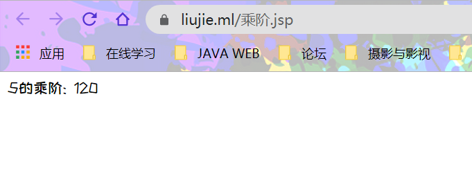
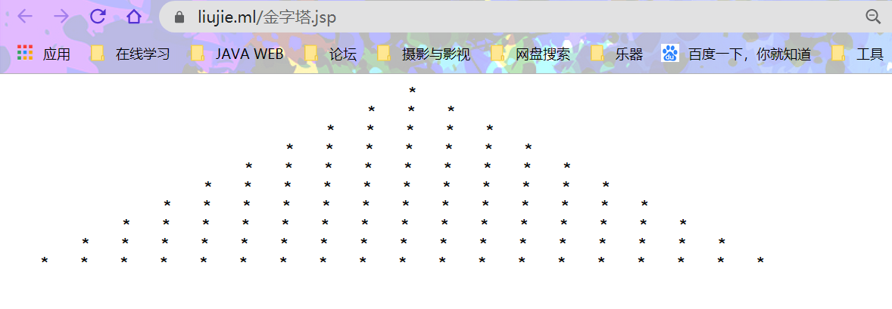
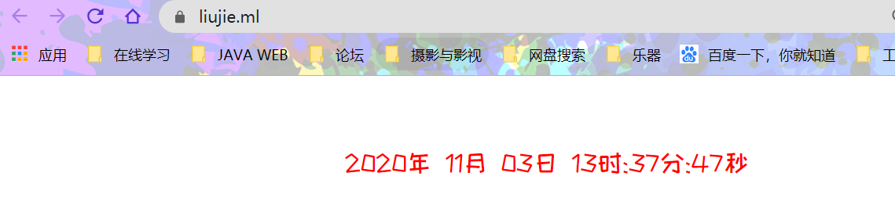

# JSP基础语法


### 1.用Java在JSP页面实现计算5的阶乘并输出结果。

```JSP
<%--
  Created by IntelliJ IDEA.
  User: 刘杰
  Date: 2020/10/29
  Time: 14:20
  To change this template use File | Settings | File Templates.
--%>
<%@ page contentType="text/html;charset=UTF-8" language="java" %>
<html>
<head>
    <title>5的乘阶</title>
</head>
<body>
<%!
    public static int factorial(int n){
        if (n==1){
            return 1;
        }else {
            return  factorial(n-1)*n;
        }
    }
%>
<%!String s = "5的乘阶: "; %>
<%=s + factorial(5)%>
</body>
</html>
```

>   **效果图**:



## 2.用Java代码实现在JSP页面输出字符“*”组成的金字塔，行数为10。

```JSP
<%@ page import="java.util.Scanner" %><%--
  Created by IntelliJ IDEA.
  User: 刘杰
  Date: 2020/10/29
  Time: 12:34
  To change this template use File | Settings | File Templates.
--%>
<%@ page contentType="text/html;charset=UTF-8" language="java" %>
<html>
<head>
    <title>输出金字塔</title>
</head>
<body>
<%
            int i, j, k, n;
            n = 10;
            for (i = 1; i <= n; i++) {
                //根据外层行号，输出星号左边空格
                for (j = 1; j <= n - i; j++)
                    out.print("&nbsp&nbsp&nbsp&nbsp&nbsp");//根据外层行号，输出星号个数
                for (k = 1; k <= 2 * i - 1; k++)
                    out.print("&nbsp&nbsp&nbsp&nbsp*");//一行结束，换行
                    out.print("&nbsp&nbsp&nbsp&nbsp<br>");
    }
%>
</body>
</html>

```

> **效果图:**




## 3.用Java代码实现在JSP页面输出完整的时间，格式为“年月日时:分:秒”。

```jsp
<%@ page import="java.util.Date" %>
<%@ page import="java.text.SimpleDateFormat" %><%--
  Created by IntelliJ IDEA.
  User: 刘杰
  Date: 2020/7/2
  Time: 21:57
  To change this template use File | Settings | File Templates.
--%>

<%@ page contentType="text/html;charset=UTF-8" language="java" %>
<html>
  <head>
    <title>JSP</title>
  </head>
  <body>
  <dir id="se">
  <%
    Date d = new Date();
    SimpleDateFormat df = new SimpleDateFormat("yyyy年 MM月 dd日 HH时:mm分:ss秒");
    out.println(df.format(d));
  %>
    </dir>
  <style>
    #se{
      width: 800px;
      height: 150px;
      margin: auto;
      line-height: 150px;
      color: red;
      font-size: 24px;
    }
  </style>
  </body>
</html>

```

> 效果图:




## JSP基础

####  JSP概述以及简单使用

**什么是JSP？**

JSP全名为Java Server Pages，java服务器页面。JSP是一种基于文本的程序，其特点就是HTML

和Java代码共同存在！

**为什么需要JSP？**

JSP是为了简化Servlet的工作出现的替代品，Servlet输出HTML非常困难，JSP就是替代Servlet输出HTML的

# jsp四大作用域和九大内置对象

> page范围：只在一个页面保留数据（javax.servlet.jsp.PageContext(抽象类)）
>
> request范围：只在一个请求中保存数据（javax.servlet.httpServletRequest）
>
> Session范围：在一次会话中保存数据，仅供单个用户使用(javax.servlet.http.HttpSession)
>
> Application范围：在整个服务器中保存数据，全部用户共享(javax.servlet.ServletContext)
>
> 他们的作用范围：
>
> **page<request<Session<Application**
>
> **out对象：**用于向客户端、浏览器输出数据。
> **request对象：**封装了来自客户端、浏览器的各种信息。
> **response对象：**封装了服务器的响应信息。
> **exception对象：**封装了jsp程序执行过程中发生的异常和错误信息。
> **config对象：**封装了应用程序的配置信息。
> **page对象：**指向了当前jsp程序本身。
> **session对象：**用来保存会话信息。也就是说，可以实现在同一用户的不同请求之间共享数
> **application对象：**代表了当前应用程序的上下文。可以在不同的用户之间共享信息。
> **pageContext对象：**提供了对jsp页面所有对象以及命名空间的访问。

#### 基础总结

<%! %>声明变量和方法；

<br>

<% %>插入Java程序片；

<br>

<%= %>插入一个表达式且必须能求值；

<br>< !-- HTML注释内容 -->;

<br><%-- jsp注释内容 --%>;

<br>page指令标记：`<%@ page 属性1="属性1的值" 属性2="属性2的值"……%>;`


##  静态包含
include静态包含
格式：<%@include file=“文件路径” %> 相对路径
file属性支持表达式去取值
特点：
只会生成一个源码文件，相当于直接将内容拷贝进来，所以不能有同名变量。
运行效率高一点点。耦合性较高，不够灵活。

##  动态包含
include动态包含
语法：<jsp:include page=“要包含的文件路径”></jsp:include>
page属性支持表达式去取值
特点：
生成多个源码文件，相当于方法的调用，可以有同名变量。
耦合度低，比较灵活，效率高。